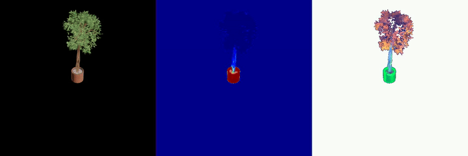

# Feature Splatting

<a href="assets/method_overview.png"> </a>

This repo implements feature splattiing, which combines gaussian splatting with feature distillation. Compared to simple
extension to the original gaussian splatting, our implementation is much faster and more memory-efficient.

For plain 768-dim feature rendering, our method achieves ~60% speedup with negligible accuracy loss (FP32->FP16).
For further speedup, we render implicit 32-dim features and then convolve them to 768-dim features. This achieves additional
~10x speedup.

## Setup dependency

Clone the codebase.

```bash
cd ~
git clone --recursive https://github.com/vuer-ai/feature-splatting-inria
```

Follow [INSTALL.md](./docs/INSTALL.md) to install required dependencies.

## Prepare data

Currently, the repo supports training from the following data formats

- Synthetic data (defined by a transforms.json and images) - [generate synthetic datasets from objaverse](./docs/synthetic_data_generation.md)

<a href="assets/objaverse_ficus.gif"> </a>

- Colmap-processed RGB images (defined by a colmap database and a folder of images)

For testing the codebase, we recommend donwloading sample datasets ([kitchen bulldozer](https://ucsdcloud-my.sharepoint.com/:u:/g/personal/riqiu_ucsd_edu/EUe9hgsPtldItgd7T1qBvxIBI9TVOzmOUfacfRDuKJ__jw?e=25kBdG),
[garden vase](https://ucsdcloud-my.sharepoint.com/:u:/g/personal/riqiu_ucsd_edu/EZGSO896TDNEq5vzyntvp-EB7xxQx-3K2R3uxpF1DIHIlA?e=Be6HcV)) and following the instructions below.

```bash
# Assume that garden_table_colmap.zip was downloaded to ~/Downloads and feature-splatting-inria is under home directory
cd ~
cd feature-splatting-inria
mkdir feat_data && cd feat_data
mv ~/Downloads/garden_table_colmap.zip ./
unzip garden_table_colmap.zip
cd ..
```

Alternatively, you can follow the instructions here to [use colmap to process your own data](./docs/custom_data_processing.md).

## Computing features

For efficient feature computation, the released code makes a trade-off with the original paper - instead of using SAM, we use MobileSAMV2 to generate
object-level masks. This drastically improves the feature extraction speed.

We have automated the weight download of MaskCLIP and MobileSAMV2 for you. To extract features, just run

```bash
python compute_obj_part_feature.py -s feat_data/garden_table
```

## Training

To train feature splatting on the sample dataset, you can run

```bash
python train.py -s feat_data/garden_table -m output/garden_table --iterations 10000
```

## Rendering

After the training is done, you can render images via,

```bash
python render.py -m output/garden_table -s feat_data/garden_table --camera_slerp_list 0 1 --with_feat --clip_feat --text_query 'a vase with flowers' --step_size 10
```

In this example, the results will be available under `output/garden_table/interpolating_camera/ours_10000/renders`. The added options render
latent features and CLIP heatmaps in response to the specified word. To visualize latent features via PCA, you can run

```bash
python pca_feature_viz.py --input_dir output/garden_table/interpolating_camera/ours_10000/renders --output_dir output/garden_table/interpolating_camera/ours_10000/pca_renders
```

and the PCA visualized images will be available in the specified output directory.

## Physics Simulation

The code for physical simulation is done in two steps. The first step is to get a 3D segmentation of the target object (with optional rigid part), and the second step is to actually
run the MPM physics engine.

To reproduce the vase+flower example, use the following segmentation commands.

```bash
python segment.py -m output/garden_table --final_noise_filtering --inward_bbox_offset 0.15 --rigid_object_name vase --interactive_viz
```

Though feature splatting has a clear object boundary due to the use of SAM, in reality, the per-gaussian features are often noisy.
Simple CLIP GS-text feature cosine similarity thresholding works for most of the Gaussians, but there are often some noises.
Hence, we implement several post-processing techniques in `segment.py`.

Empirically, for selecting objects using your own data, here are the important ones

### Text prompting

- `--fg_obj_list`: text prompts for positive objects, separated by commas.
- `--bg_obj_list`: text prompts for background objects (object near FG object that needs to be excluded), separated by commas
- `--ground_plane_name`: a *single* text string for ground plane contact with the object (e.g., *tabletop*, *floor*).
- `--rigid_object_name` (Optional): given a foreground object, select high-confidence rigid particles inside

### Post processing

- `--object_select_eps` (float): EPS for the DBSCAN clustering algorithm to select a single primary object. If some parts of the object are missing -> increase EPS.
    If it includes unwanted parts of other similar objects -> decrease EPS. This may require some tweaking due to the scale ambuiguity of colmap.
- `--inward_bbox_offset` (float, Optional): This function selects GS within a ground-aligned bbox. Larger offset = more conservative bbox. Smaller offset = more aggresive bbox.
- `--final_noise_filtering` (bool, Optional): If True, do an inverse KNN dilation to filter out final noises around the object.

In addition, we alos offer an option `--interactive_viz` to visualize the effects of every post-processing methods.

After the object is segmented, run

```bash
python mpm_physics.py -m output/garden_table --rigid_speed 0.3 --use_rigidity
```

which would compute the per-particle trajectory of selected Gaussians. To render the physical movement, run,

```bash
python render.py -m output/garden_table -s feat_data/garden_table --camera_slerp_list 54 58 --step_size 500 --with_editing
```

The output is also located at `output/garden_table/interpolating_camera/ours_10000/renders`.

## TODOs

- [ ] Add instructions for serializing synthetic assets from objaverse
- [ ] Support more interactive GS selection process with Vuer / supersplat canvas
- [ ] Experiment with projection-based method that would remove need for post-processing
- [ ] Organize code for rotation estimation
- [ ] Multi-scale CLIP features
- [ ] Add support for sparse graident computation in custom pytorch Ops to save GPU memory.
